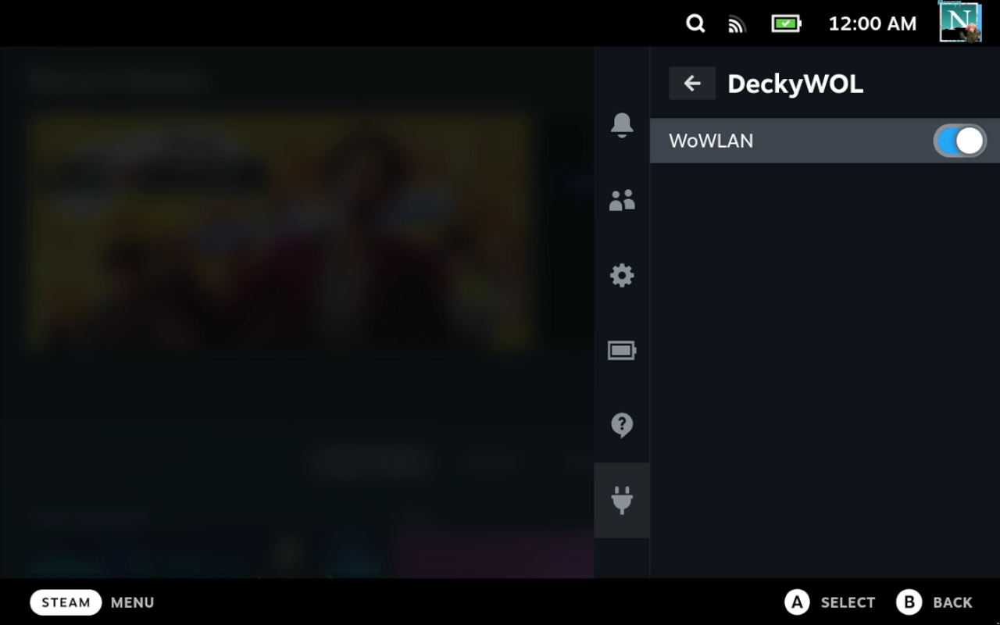

# DeckyWOL

A Steam Deck plugin (for Decky Loader) to enable WOL for SteamDecks internal WiFI.



## How it works:
- It issues an IW command to enable the WoWLAN functionality for the steam decks internal wifi
- We have two systemd services:
   - one to ensure that we interrupt the hibernation with a call to s3 instead
   - the other makes sure the hardware is unblocked. (as this plugin is still experimental more testing to come on this...)

## How to use it:
- Click on toggle for WoWLAN
- Press your SteamDeck top power button once to put it to sleep
- Use a tool such as: `wakeonlan` to wake up your deck: `ie: $ wakeonlan 0a:de:ea:db:ee:fe`, our be fancy and setup homebridge to toggle it from your phone through siri

## TBD / To-Do:
- No idea how this effects the battery.
- Not sure there is any impact if you disable wifi power management option in steam developer menu.
- Dock support
- Why didn't Valve give us an official option?
- What fun things can we do with Bluetooth to wake the system?


## Installation

Install through Decky plugin store.

## Build instrutions
1. Clone the repository to use as an example for making your plugin.
2. In your clone of the repository run these commands:
   1. ``pnpm i``
   2. ``pnpm run build``
3. You should do this every time you make changes to your plugin.

Note: If you are recieveing build errors due to an out of date library, you should run this command inside of
your repository:

```bash
pnpm update decky-frontend-lib --latest
```

# License
This project is licensed under the terms of the BSD 3-Clause License. You can read the full
license text in [LICENSE](LICENSE).
